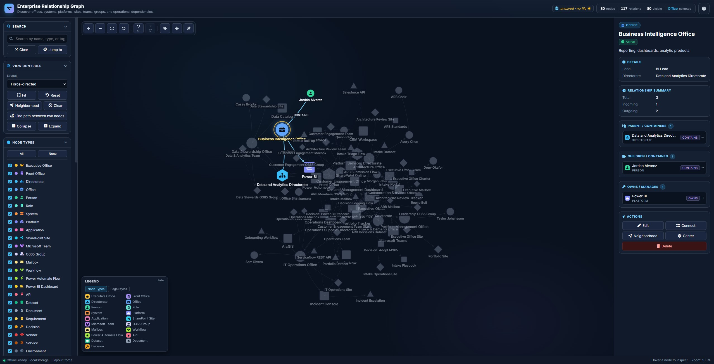

# Enterprise Relationship Graph

A single-file, offline-capable, browser-based tool for mapping how offices, systems, platforms, applications, SharePoint sites, Microsoft Teams, O365 groups, mailboxes, workflows, APIs, datasets, documents, and people connect across an enterprise.

Built for architecture reviews, leadership briefings, operational awareness, onboarding, and discovery work. Open one HTML file in any modern browser. No server. No build. No install.

> **[Try the live demo](https://rjbethune.github.io/enterprise-relationship-graph/enterprise-relationship-graph.html)** — runs in your browser, no install needed.

---

## Screenshot



---

## What it does

Click any node — an office, system, platform, application, person, mailbox — and the right-hand panel becomes an automatically generated profile: who owns it, what it depends on, which SharePoint site backs it, which Power Automate flows run through it, what it reports to, which people work in it. Click any relationship in the panel to navigate to that node. Search to find anything by name, type, or tag. Use the path-finder to discover how the CRM Workspace is connected to the Executive Office in four hops.

It's a tool for understanding an enterprise's relationships at a glance and curating that understanding over time.

## Quick start

1. **Download** [`enterprise-relationship-graph.html`](enterprise-relationship-graph.html).
2. **Double-click** to open in your browser. (Or visit the [live demo](https://rjbethune.github.io/enterprise-relationship-graph/).)
3. Click **Load sample data** in the sidebar to see ~80 example nodes with ~90 relationships covering an Executive Office, four Directorates, eight Offices, ten people, a stack of Microsoft 365 platforms, eight applications, sites, teams, groups, mailboxes, workflows, APIs, datasets, documents, and decisions.
4. Click any node. Explore. Press **?** to open the in-app help.

When you're ready to build your own graph: click **Open** to load a JSON file as your working document, or just edit the sample and click **Save As...** to make it yours. Every change auto-caches to localStorage as a safety net.

## Features

**Visual graph**
- Four layout algorithms (force-directed, hierarchical, concentric, grid)
- Node shape and color both encode entity type
- Font Awesome icons inside nodes; brand icons for Microsoft, Salesforce, etc.
- Edge styles by category: hierarchy, ownership, dependency, integration, hosting, docs
- Pan / zoom / drag with smooth interaction

**Editing**
- Add, edit, delete nodes and relationships
- Quick-connect: select source, press `C`, click target
- Right-click context menus everywhere
- 30-step undo / redo
- User-defined custom node types stored with the graph

**Discovery**
- Search by name, type, or tag with pulse-glow highlighting
- Path-finding between any two nodes (BFS, undirected)
- Neighborhood-only view to hide everything except a selected node's direct connections
- Filters for node types and relationship types

**Analysis**
- What-if scenario mode: non-destructively disable nodes and watch the impact ripple out — broken dependents turn red, and structurally orphaned children (an office and its people under a disabled directorate) turn amber — all without touching the saved graph
- Single-point-of-failure detection: finds articulation points — nodes whose removal would split the graph — and rings them in amber
- Staleness heatmap: tints nodes by time since last edit (press `H`), so you can see at a glance what needs re-validation
- Dim relationships toggle: shade edges back so a dense graph reads calmly; hover or select a node to light up just its connections

**Bulk curation**
- Multi-select with Ctrl/Cmd+click or Shift+drag a lasso box
- Bulk-edit the selection: set type, status, owner, lead, directorate, office, platform, or append tags across many nodes at once (auto-edges re-sync)

**Views & briefing**
- Saved views capture filters + layout + zoom + selection as named perspectives ("Data flows only", "Exec org chart") — distinct from data snapshots, and stored in the file so they travel with it
- Presentation walkthroughs: build an ordered tour of nodes with a sentence of narration each, then play it fullscreen and step through with the arrow keys

**Auto-sync**
- Setting *Parent*, *Reports to*, *Directorate*, *Office*, *Platform*, *Owner*, or *Lead* on a node automatically creates or updates the corresponding edge in the graph. Renaming or clearing the field updates the edge cleanly.

**Data & sharing**
- File-as-source-of-truth: open a JSON file, edit, save back to the same file (uses the File System Access API in Chrome and Edge; downloads in Firefox / Safari)
- JSON bundle export includes the graph, all custom types, and named snapshots
- CSV export (nodes + edges) and Excel (.xlsx) workbook export
- High-resolution PNG export for slides
- Named snapshots for milestones ("Sept 2025 baseline", "Post-reorg proposal")
- Drag-and-drop JSON files onto the window to open
- Unsaved changes warning before tab close

**Accessibility & polish**
- Real dialog semantics with focus trap and restoration
- Keyboard-navigable canvas (Tab cycles nodes, arrows move cardinally)
- Status meaning carried by color + icon + text, not color alone
- 44×44 touch targets, mobile breakpoint at 900 px
- Smooth section collapse animations

**Keyboard shortcuts**

| Key | Action |
|-----|--------|
| `Ctrl+S` | Save working file |
| `Ctrl+O` | Open file |
| `Ctrl+Z` / `Ctrl+Y` | Undo / Redo |
| `?` | Open help |
| `F` | Fit graph to view |
| `R` | Reset zoom |
| `C` | Quick-connect from selected node |
| `N` | New node |
| `E` | Edit selected |
| `L` | Toggle always-on edge labels |
| `M` | Toggle Layout mode (drag without selecting) |
| `H` | Toggle staleness heatmap |
| `Ctrl+click` | Add/remove a node from the multi-selection |
| `Shift+drag` | Lasso-select nodes inside a box |
| `←` / `→` | Step through a presentation walkthrough (when playing) |
| `Ctrl+F` | Focus search |
| `Esc` | Cancel any active mode |

## Data model

A graph is a JSON file with this shape:

```json
{
  "version": 2,
  "graph": {
    "nodes": [
      {
        "id": "off-ce",
        "label": "Customer Engagement Office",
        "type": "Office",
        "description": "Engages customers and stakeholders.",
        "directorate": "Operations Support Directorate",
        "lead": "Customer Engagement Lead",
        "tags": ["customer"],
        "status": "Active"
      }
    ],
    "edges": [
      {
        "id": "e42",
        "source": "off-ce",
        "target": "app-crm",
        "type": "OWNS"
      }
    ],
    "customNodeTypes": [
      { "name": "Cloud Service", "color": "#22D3EE", "shape": "diamond", "icon": "", "size": 16 }
    ]
  },
  "snapshots": [
    { "id": "...", "name": "Sept 2025 baseline", "ts": 1727795200000, "graph": { ... } }
  ]
}
```

**Entity types** (built-in, 25 total): Executive Office, Front Office, Directorate, Office, Person, Role, System, Platform, Application, SharePoint Site, Microsoft Team, O365 Group, Mailbox, Workflow, Power Automate Flow, Power BI Dashboard, API, Dataset, Document, Requirement, Decision, Vendor, Service, Environment, Other. You can define your own.

**Relationship types** (26 total): CONTAINS, REPORTS_TO, OWNS, MANAGES, SUPPORTS, USES, DEPENDS_ON, HOSTED_ON, CONNECTED_TO, INTEGRATES_WITH, HAS_SITE, HAS_TEAM, HAS_O365_GROUP, HAS_MAILBOX, SENDS_TO, RECEIVES_FROM, AUTOMATES, STORES_DATA_IN, VISUALIZED_IN, DOCUMENTED_IN, APPROVED_BY, REQUESTED_BY, RESPONSIBLE_FOR, BACKUP_FOR, PART_OF, OTHER.

The in-app help (press `?`) defines what each one means.

## Browser support

| Browser | Open / Save in place | Open / Download | All other features |
|---------|---------------------|------------------|--------------------|
| Chrome  | ✓ | ✓ | ✓ |
| Edge    | ✓ | ✓ | ✓ |
| Firefox |   | ✓ | ✓ |
| Safari  |   | ✓ | ✓ |

The File System Access API (in-place save) is Chromium-only; in Firefox and Safari the Save button downloads a new copy of the JSON which you replace your working file with manually. Every other feature works identically across browsers.

## Architecture

Single HTML file, three layers in one document:

- **CSS** — design tokens via CSS custom properties, dark theme tuned for command-center / architecture-dashboard use, layout via CSS Grid.
- **HTML** — semantic landmarks (`<header>`, `<aside>`, `<main>`, `<footer>`), real `<button>` elements with ARIA where needed, hidden dialogs for modals and overlays.
- **JavaScript** — vanilla JS, no framework, no build. A custom Canvas renderer (no graph library). The force simulation uses a Barnes-Hut quadtree for O(n log n) repulsion and freezes once the layout settles (zero CPU until you drag, edit, or change layout), and hit-testing uses a spatial hash — together these keep graphs into the low thousands of nodes interactive. Past that, the practical limit becomes legibility (a force-directed graph of thousands of nodes is hard to read regardless of speed), best handled with the built-in collapse, filter, and search tools rather than raw rendering throughput.

Why one file? It's the simplest possible distribution: email it, drop it on a USB stick, host it on any static URL, double-click it. No `node_modules`, no transpilation, no dependencies you have to keep current. You can read every line of the application in one file with `Ctrl+F`.

External dependencies, loaded via CDN with CORS:
- **Font Awesome 6 Free** for icons (solid + brands)
- **Inter** from Google Fonts for typography

Both fail gracefully: if offline at first load, the app still works with system fonts and no icons.

## License

[MIT](LICENSE). Use it, fork it, embed it, customize it for your organization.

## Acknowledgments

Originally written for an Executive Office's architecture and operational awareness work. The data model and feature set evolved from real use against a real enterprise org chart.

If you find it useful — or build something neat on top of it — I'd be glad to hear about it.
